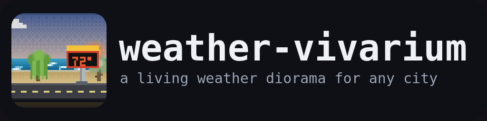
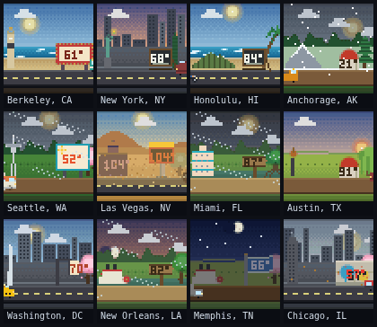

<p align="center">
  
</p>

> **Version:** 0.3.0

A tiny **living pixel-art weather diorama** for *any* city — dependency-free, drop
anywhere. Give it a place (or let it find yours) and its sky, sun, moon phase,
weather, tide, wind, landscape and a signature landmark come alive in a 100×100
jewel, driven by that place's real current conditions and its own sunrise/sunset.

It's the [Los Angeles beach widget from `kevin-website`](https://github.com/cportka/kevin-website)
generalised: same hand-built vintage-pixel soul, now for the whole world.

<p align="center">
  <a href="https://cportka.github.io/weather-vivarium/gallery.html">
    
  </a>
  <br />
  <em>A dozen cities, each on its current weather — or wander the <a href="https://cportka.github.io/weather-vivarium/gallery.html">live wall of 1000 →</a></em>
</p>

**[▶ Try any city / see yours (live demo)](https://cportka.github.io/weather-vivarium/)** ·
**[▶ 1000-city gallery](https://cportka.github.io/weather-vivarium/gallery.html)**

## Quick start

No build step, no dependencies. As an ES module:

```html
<div id="weather"></div>
<script type="module">
  import { createVivarium } from "https://cportka.github.io/weather-vivarium/src/index.js";
  createVivarium("#weather", { city: "Kyoto", size: 300, interactive: true });
</script>
```

Or from npm (once published — `1.0.0`):

```js
import { createVivarium } from "weather-vivarium";
createVivarium(document.querySelector("#weather"), { city: "Reykjavík" });
```

Give it a city name (geocoded) **or** explicit coordinates:

```js
createVivarium("#w", { lat: 21.31, lon: -157.86, timezone: "Pacific/Honolulu", country: "United States" });
```

## Options

| option | default | meaning |
| --- | --- | --- |
| `city` | — | City name to geocode (Open-Meteo). |
| `lat`, `lon` | — | Explicit coordinates (skip geocoding). |
| `timezone` | `"UTC"` | IANA zone — so the sun sets at the *place's* dusk. |
| `elevation`, `country`, `admin1` | — | Improve biome/unit resolution. |
| `biome`, `landscape` | auto | Force a look (see the catalog below). |
| `temperatureUnit` | `"auto"` | `"fahrenheit"` \| `"celsius"` \| `"auto"` (country default). |
| `size` | `100` | Display size in px (the art is a crisp integer upscale). |
| `interactive` | `false` | Click to zoom to a centred overlay. |
| `reduceMotion` | auto | Render a single still frame. |
| `refreshMs` | `600000` | How often to re-fetch weather. |

The returned instance exposes `resolution`, `weather`, `setPlace`, `setWeather`,
`setTimeOverride`, `refresh`, `start`/`stop`, and `destroy`.

## What's inside

Everything is real pixel art, selected per place and per weather:

- **14 biomes / backgrounds** — coast, ocean, mountain, desert, forest, jungle,
  plains, city, tundra, wetland, lake, savanna, canyon, farmland.
- **29 named landscapes** mapping real cities onto biomes (Malibu, Manhattan,
  Alpine, Sonoran, Amazon, Serengeti, Arctic, Tuscany, …).
- **50+ vehicles** (road + watercraft), **40+ animals** (ground / water / air),
  **20+ people**, **20+ trees**, **10+ birds**, **10+ signs**, and a growing set of
  **city landmarks** (Statue of Liberty, Space Needle, casino, Diamond Head,
  riverboat, pyramids, …) matched to the city by name.
- **Live everything** — sun arc + sunrise/sunset for the place, moon with its real
  phase, stars, drifting clouds, rain, snow, fog, storm lightning, wind-blown
  debris, rainbows, aurora (high-latitude nights), sandstorms, heat shimmer, hail,
  a tide-driven waterline, and a temperature sign.

Content is chosen by matching each catalog entry's biome list to the resolved
biome, so a diorama is always populated with things that belong there.

## City database

`data/cities/` holds precomputed lookups from a city to its resolved vivarium —
biome, landscape, landmark, category, unit — so a known city renders from **only
its current weather**, no geocoding hop. Two datasets ship: a curated
`us.json` (`npm run build:cities`) and a `world.json` of the top 1000 cities
worldwide (`npm run build:cities -- --world`, from GeoNames via `all-the-cities`,
with offline timezones from `tz-lookup`). The roadmap (US → Mexico/Canada →
Europe/Asia → the world, toward the ~5M named places) and the GeoNames ingest are
in [`data/cities/README.md`](data/cities/README.md).

> Note: for cities not in a curated landscape, the biome is a best-effort guess
> from latitude/elevation — coastal and climate detection for the long tail is on
> the roadmap.

## Development

This repo follows the [Portka standard](.claude/CLAUDE.md): every change goes on a
branch, updates tests + CI, and merges on green. `package.json` is the version
source of truth (SemVer), kept in sync with `CHANGELOG.md`, this README's version
line, and `src/index.js`.

```
npm test                 # version sync + syntax + node --test (catalog / resolver / every-sprite render)
npm run verify:render    # headless-Chromium contact sheets + example scenes (verify/out/)
npm run build:cities     # rebuild the city database
```

Adding a sprite is one object in a `src/catalog/parts/*` file — see
[`src/catalog/_contract.md`](src/catalog/_contract.md).

## Credits

- Weather, marine, air-quality and geocoding data from [Open-Meteo](https://open-meteo.com) (keyless, CORS).
- City coordinates seed hand-curated; the full pipeline ingests [GeoNames](https://www.geonames.org) (CC BY 4.0).
- Born from the Los Angeles beach diorama in [kevin-website](https://github.com/cportka/kevin-website).

## License

MIT © Chris Portka
